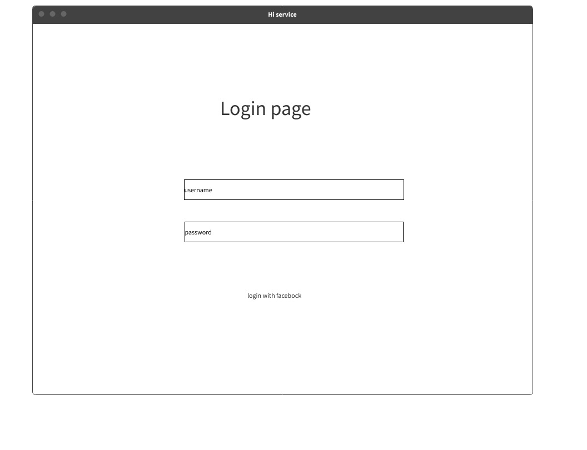
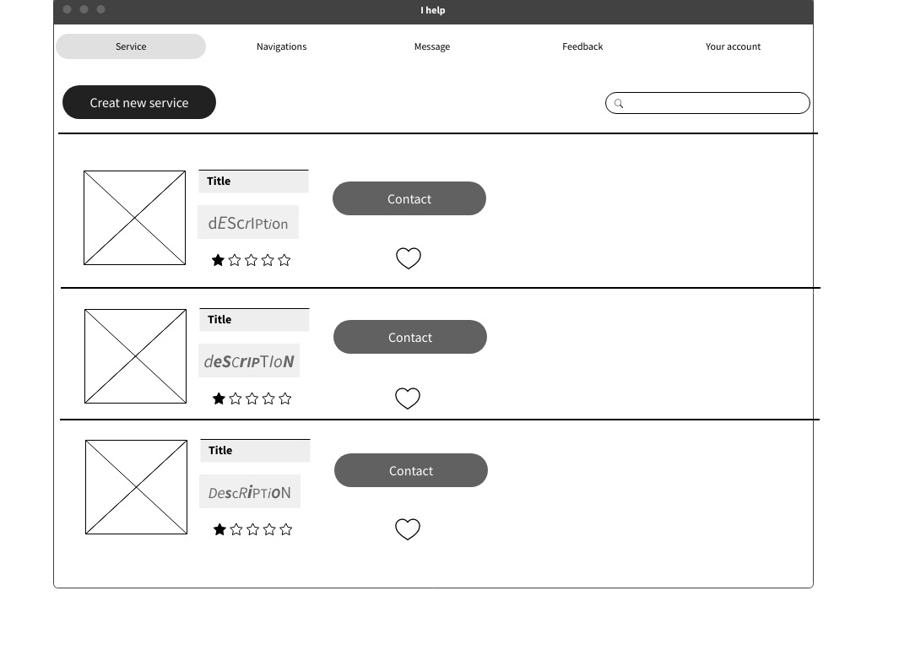
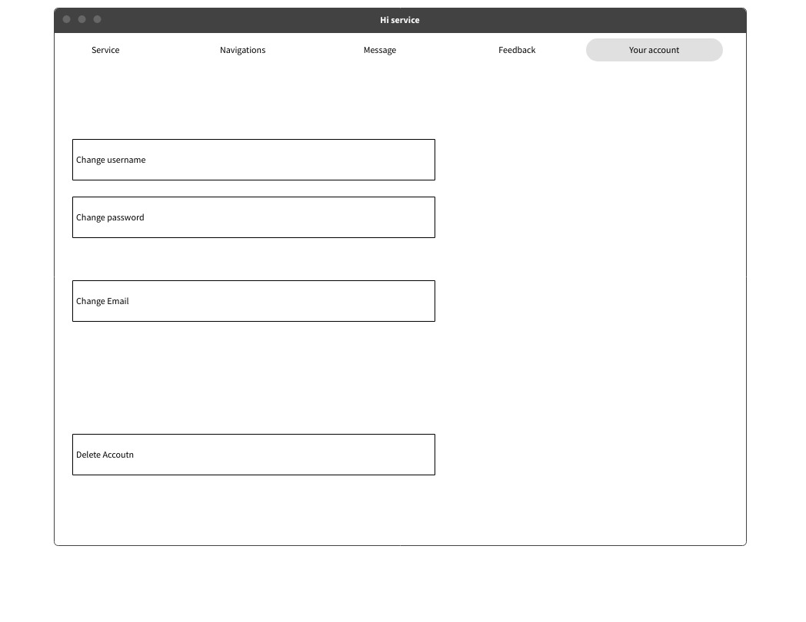
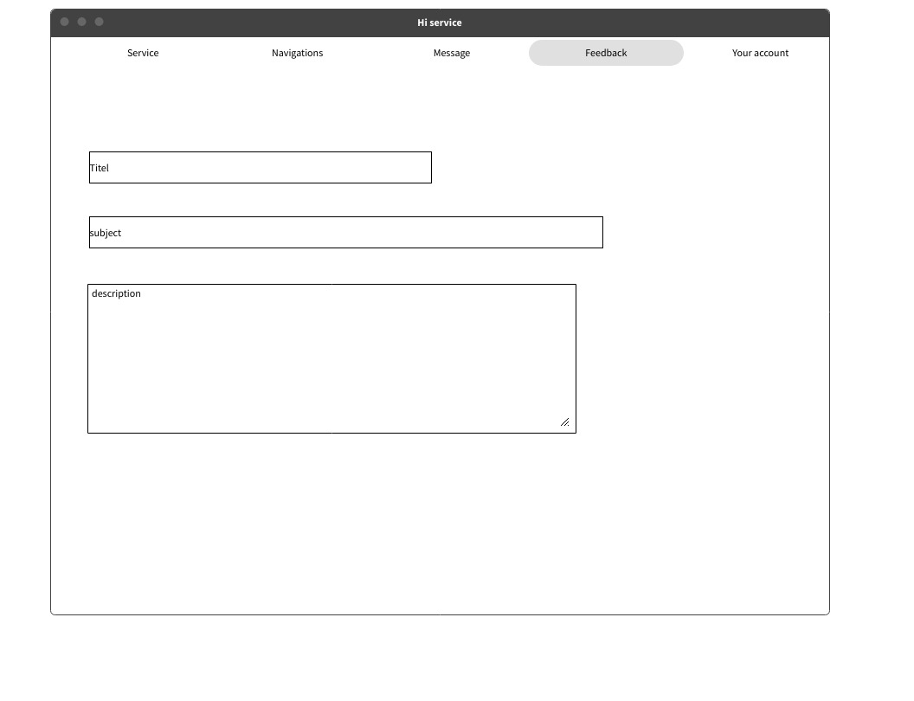
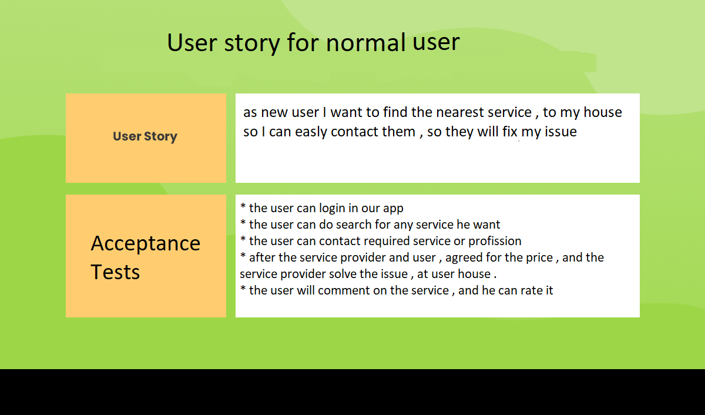
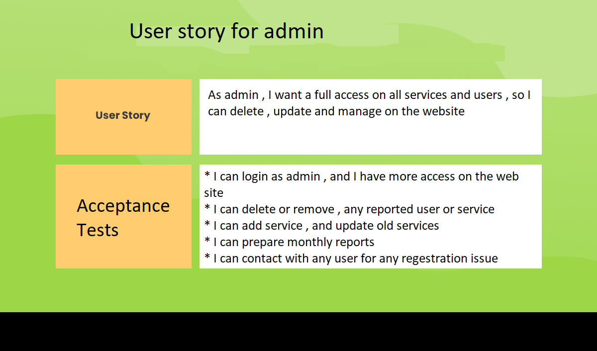
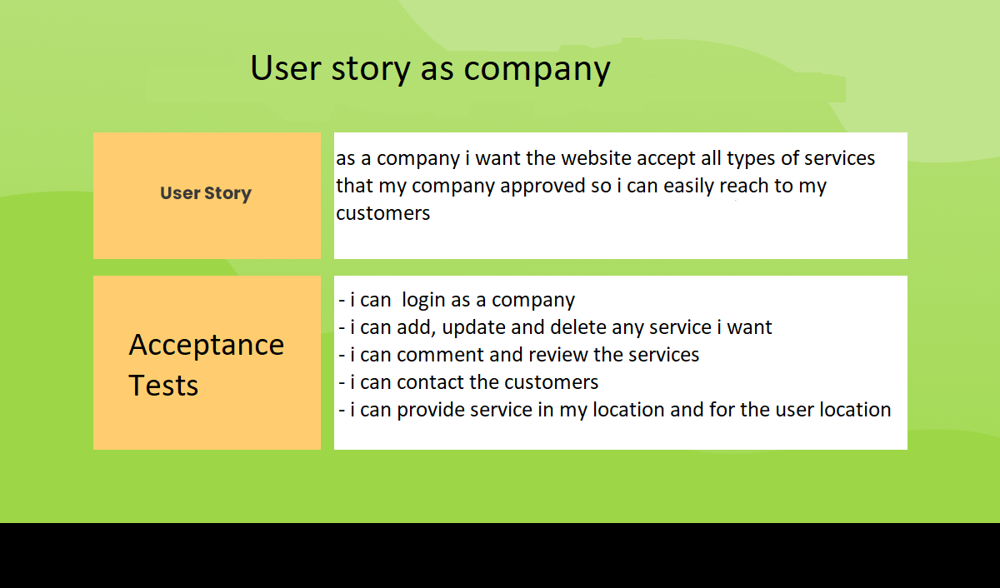
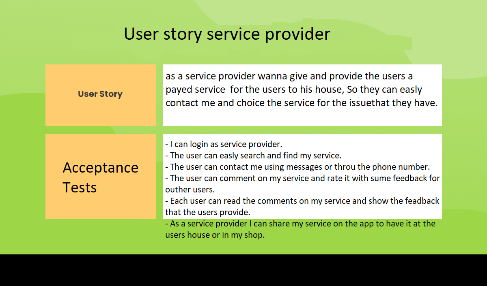
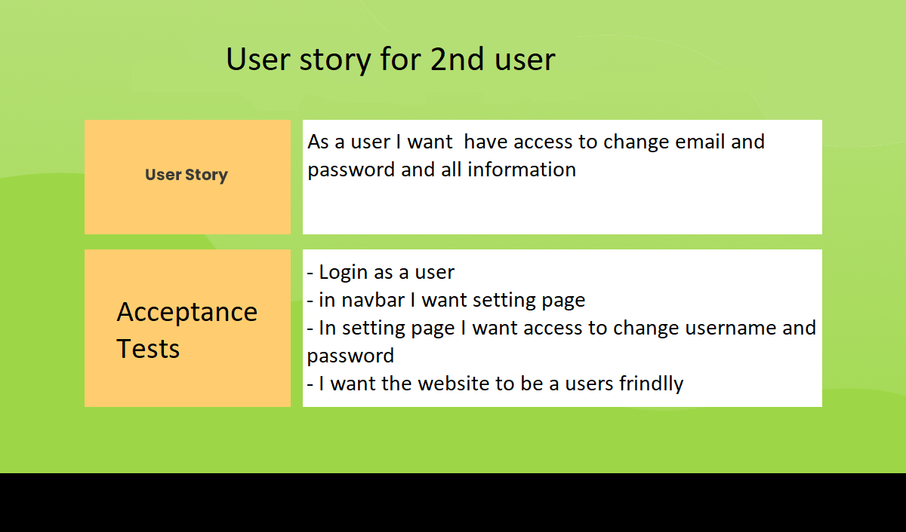

# Hi-service

## Begin Wireframes

* we prepare simple wirefram for our app , from the main page until the user settings , all shown below

.png)

.png)

.png)

## User Stories

* we prepare user stories

## Domain Modeling

* we create simple model for our app that show the relationships between the functions/methods and entities
 

## Using a Database? Make an Database Schema Diagram

* we prepare our database and tables as shown in the pic

* we created 3 tables , as start
  * main table for the users , it will contain username , password , role , Email, and  it will have relation to other all table

  * 2nd table will be for the services , we will save all type of services in this table , nameProfession , image , description, city or location , phone number , userId
    * it will be **many services to one user**

  * 3rd table will be interactions , we will save comments , rates and add to Favorite for each service

  * we have relation and connection between interaction , the user table and service table
